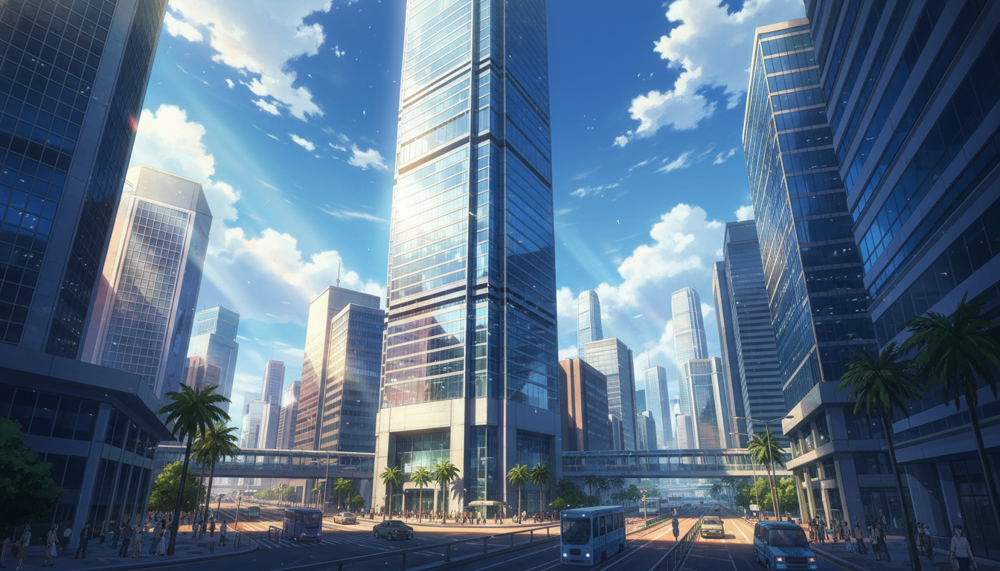

# Image Generation for Zine

## Setup

1. Make sure your `.env` file has:
   ```
   OPENROUTER_API_KEY=sk-or-v1-...
   ```

2. Install dependencies:
   ```bash
   pip install -r requirements.txt
   ```

3. Run the image generator:
   ```bash
   python3 generate_images.py
   ```

## Troubleshooting

If you get "User not found" (401 error):
- Check that your OpenRouter API key is valid and active
- Make sure you have credits/balance on your OpenRouter account
- Verify the API key in your `.env` file matches your OpenRouter dashboard

## Images Generated

The script will generate these images in the `images/` directory:

1. `hongkong_office.png` - Hong Kong office building
2. `voice_cloning_attack.png` - Voice cloning visualization
3. `password_cracking.png` - Password cracking visualization
4. `sim_swap_attack.png` - SIM swap attack flow
5. `three_locks.png` - Three overlapping locks
6. `chain_links.png` - Security chain visualization
7. `yubikey_product.png` - YubiKey product photo
8. `timeline_evolution.png` - Security evolution timeline
9. `ceo_portrait.png` - CEO portrait

## Manual Image Addition

If API generation doesn't work, you can:

1. Use free stock photos from Unsplash, Pexels, or Pixabay
2. Create simple graphics using Canva or Figma
3. Use the prompts in `generate_images.py` with other AI image generators

## Updating the Zine

Once images are generated, update `zine-final.html` to reference them:

```html

```

